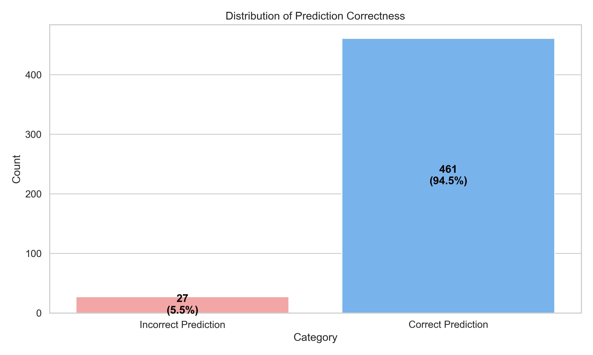
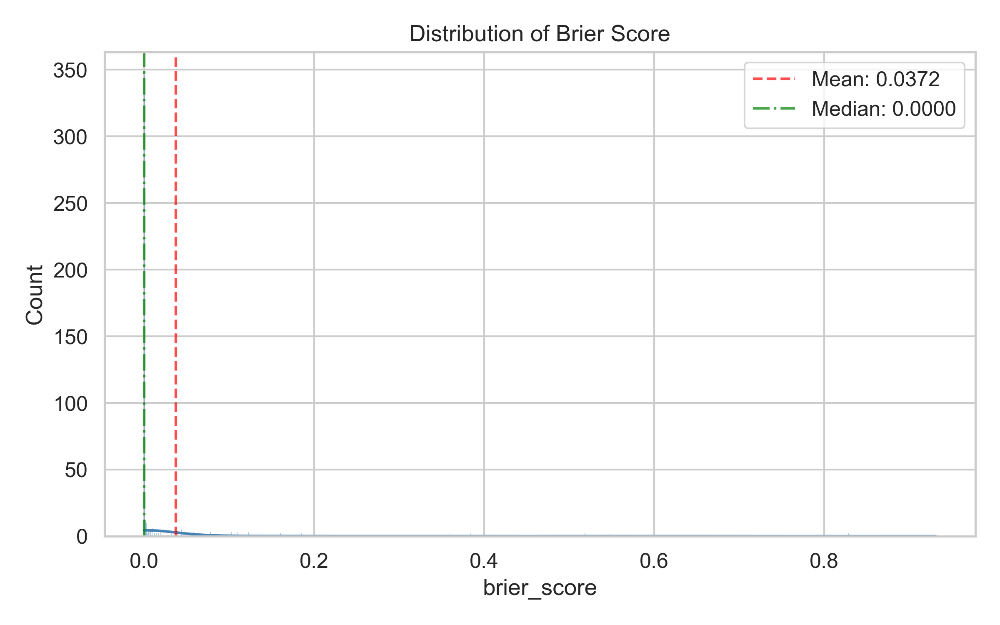
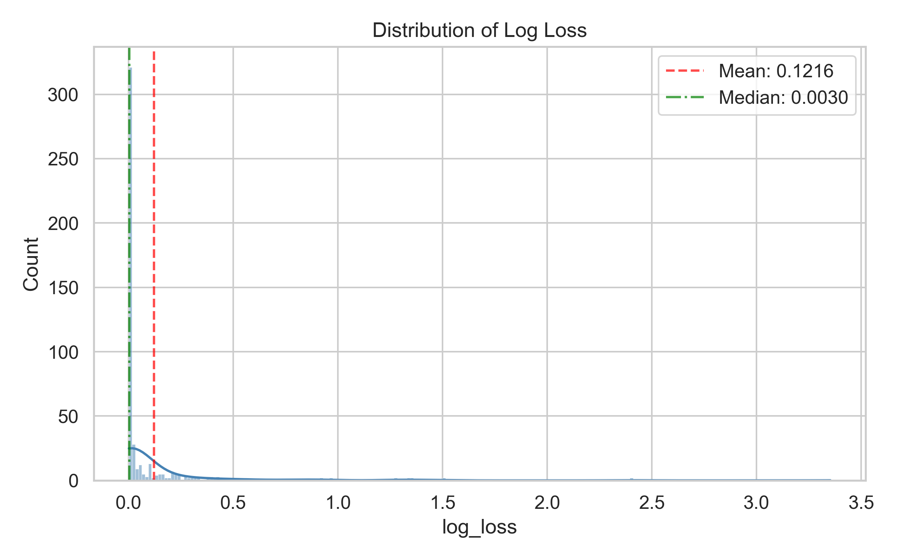
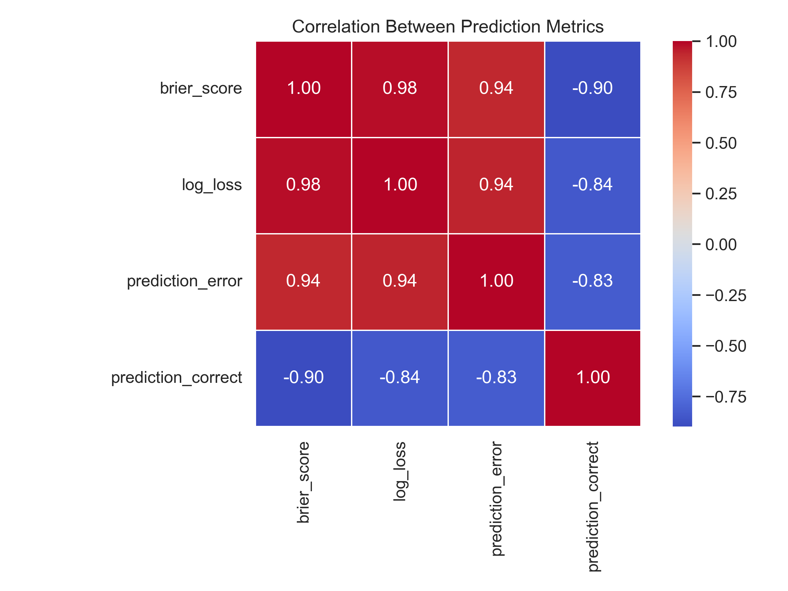
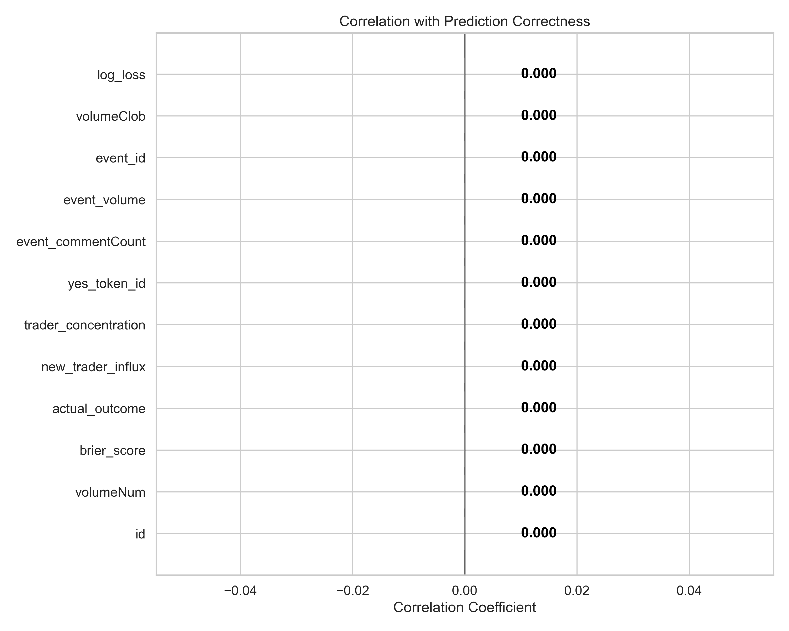
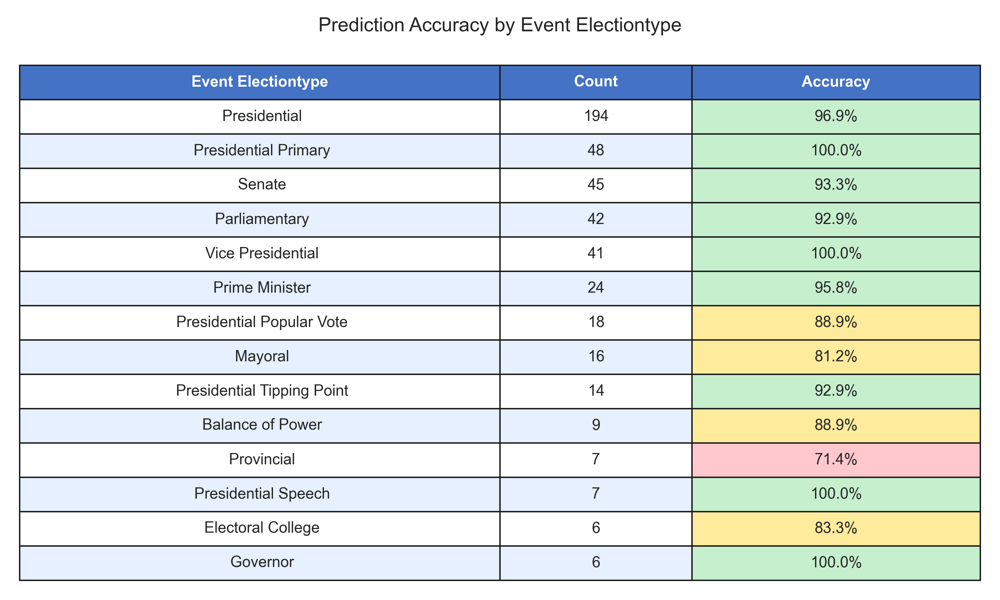
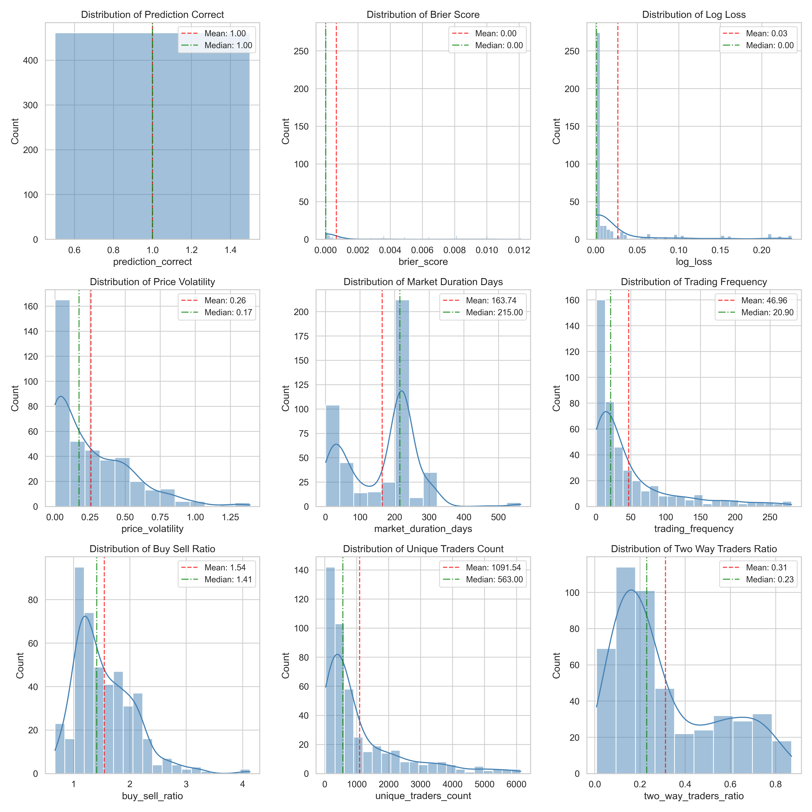

# Polymarket Election Markets Analysis: Summary Statistics

*Generated on: 2025-03-14 22:55:02*

## Dataset Overview

- **Total Markets:** 1048575
- **Total Features:** 54

## Target Variable Analysis

### Prediction Correctness Distribution

- **Correct Predictions:** 461 (94.5%)
- **Incorrect Predictions:** 27 (5.5%)

- **Class Imbalance Ratio:** 17.07

## Prediction Quality Metrics

### Summary of Pre-calculated Metrics

- **Brier Score (Mean):** 0.0372
- **Brier Score (Median):** 0.0000

- **Log Loss (Mean):** 0.1216
- **Log Loss (Median):** 0.0030

### Correlation Between Metrics

## Correlations with Prediction Correctness

## Election Type Analysis

## Feature Distributions

## Recommendations for Metric Selection

Based on the analysis of the pre-calculated metrics, we recommend:

1. **Use Brier Score as primary metric** - Provides a balanced assessment of prediction accuracy
2. **Use Log Loss as supporting metric** - Penalizes confident but wrong predictions
3. **Use prediction correctness for simplicity** - When a binary measure is needed for interpretability

## Summary

The markets show an overall prediction accuracy of 94.5%. The analysis identified key factors associated with prediction accuracy that can help understand which features contribute to successful predictions in election markets.
